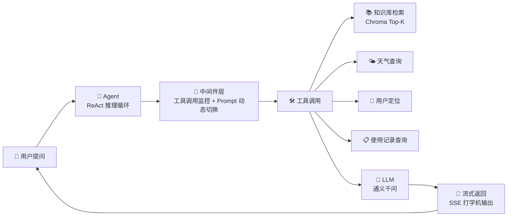

# 面向智能硬件售后的 RAG Agent 问答与使用分析系统

> 🚀 在线体验 Demo：https://modelscope.cn/studios/AaanO312/smart-hardware-agent

     

扫地机器人售后 AI Agent — 基于 RAG 知识库 + ReAct Agent 的智能问答系统。

支持故障排查、维护建议、使用报告生成。Agent 自主调用 7 个工具，根据用户意图动态切换 Prompt。

## 架构



- **用户提问**：自然语言输入，支持故障排查、维护建议、报告生成等场景
- **Agent (ReAct)**：LangChain ReAct Agent，自主推理 + 决策工具调用顺序
- **中间件层**：监控每次工具调用；识别用户意图后动态切换系统 Prompt（普通问答 ↔ 报告生成）
- **工具调用**：7 个工具覆盖知识检索、天气、定位、外部数据查询等
- **LLM**：通义千问模型，结合检索上下文和 Prompt 生成回答
- **流式返回**：SSE 真流式输出，打字机效果逐字返回

## 功能特性

- 基于 RAG 实现扫地机器人知识库问答，支持故障排查、维护保养、使用建议等问题。
- 使用 Chroma 构建本地向量数据库，支持 PDF/TXT 文档解析、切分、Embedding 入库和相似度检索。
- 基于 LangChain Agent 实现 Tool Calling，支持知识库检索、天气查询、用户位置获取和使用记录查询。
- 支持动态 Prompt 切换，区分普通问答和月度使用报告生成场景。
- 接入日志模块，记录模型调用、工具调用和异常信息，便于调试。
- 基于 FastAPI StreamingResponse 实现 SSE 真流式输出，结合 `asyncio.to_thread` 解决同步生成器阻塞事件循环问题，实现打字机式逐字返回。

## 技术栈

- Python 3.12
- Streamlit
- LangChain
- Chroma
- FastAPI
- Docker
- PyPDF
- DashScope / 通义千问
- uv

## 项目结构

```text
.
├── agent/              # Agent 构建、工具函数和中间件
├── config/             # 模型、向量库、Prompt 和外部数据配置
├── data/               # 知识库文件和用户使用记录
├── model/              # 模型与 Embedding 初始化
├── prompts/            # 主提示词、RAG 提示词和报告提示词
├── rag/                # 向量库加载、检索与 RAG 回答生成
├── utils/              # 配置、日志、文件和路径工具
├── app.py              # Streamlit 应用入口
├── api.py              # FastAPI SSE 流式接口
├── pyproject.toml
└── uv.lock
```

## 环境要求

- Python >= 3.12
- uv
- DashScope API Key

## 安装依赖

```powershell
uv sync
```

## 配置 API Key

本项目使用 DashScope 通义千问模型，需要提前配置环境变量。

PowerShell 临时配置：

```powershell
$env:DASHSCOPE_API_KEY="your_api_key_here"
```

注意：不要将真实 API Key 写入代码或上传到 GitHub。

## 运行项目

**本地开发：**

```powershell
streamlit run app.py
```

**Docker 一键启动：**

```bash
docker-compose up --build
```

启动后访问：
- 前端界面：http://localhost:8501
- API 文档：http://localhost:8000/docs

## 示例问题

```text
扫地机器人无法回充怎么办？
```

```text
地图丢失一般是什么原因？
```

```text
宠物家庭应该怎么维护扫地机器人？
```

```text
梅雨季适合开拖地模式吗？
```

```text
帮我生成本月扫地机器人使用报告
```

## 知识库说明

项目会从 `data/` 目录读取知识库文件，并写入本地 Chroma 向量库。

当前知识库规模：
- **3 个**知识库文档（基础知识库 / 故障排查 / 维护保养与使用建议）
- 约 **200+ 条**文本切分片段
- Top-K=**3** 语义检索

推荐知识库文件：

```text
data/扫地机器人基础知识库.txt
data/扫地机器人故障排查知识库.txt
data/扫地机器人维护保养与使用建议.txt
```

用户使用记录示例数据：

```text
data/external/records.csv
```

如需重新构建知识库，可删除本地生成的：

```text
chroma_db/
md5.text
```

然后重新运行知识库加载流程。

## 项目亮点

- 面向垂直领域的 RAG 问答系统
- Agent Tool Calling 多工具调用
- 本地向量知识库构建与检索
- 外部用户数据查询与报告生成
- Prompt 分层设计与动态切换

## 效果展示


> 截图待补充
